# Portafirmas

Aplicación de portafirmas integrada con Autofirma.

*El código de esta aplicación es privado. Únicamente se muestra la descripción del proyecto.*

## Descripción funcional

Breve descripción a nivel funcional de la aplicación

### Pantalla de login

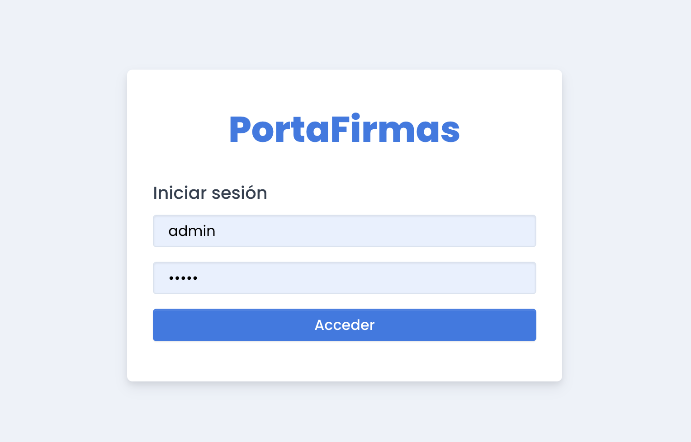

### Firma, validación y rechazo de un documento

Son las operaciones básicas a realizar como usuario sobre cualquier documento. El portafirmas posee su propia integración con Autofirma.

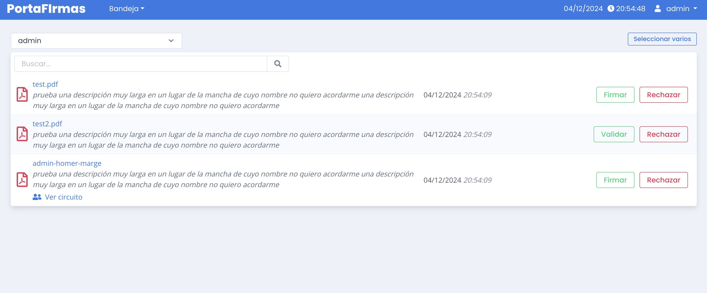

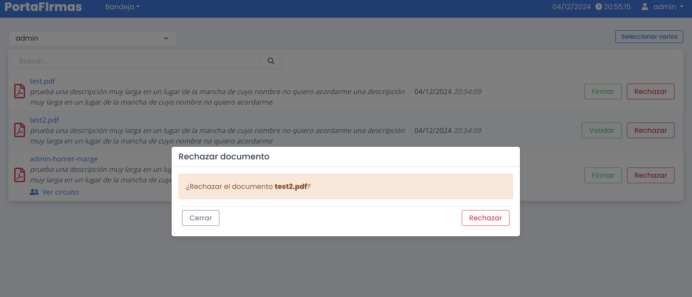

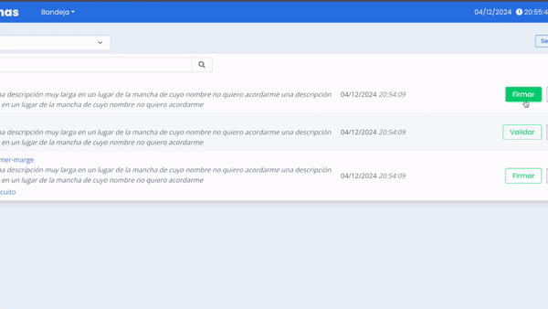

Las operaciones de firma y validación o rechazo pueden ser realizadas masivamente.

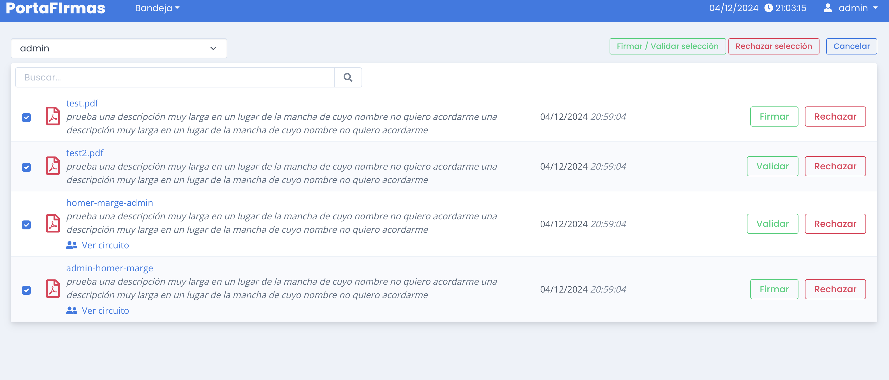

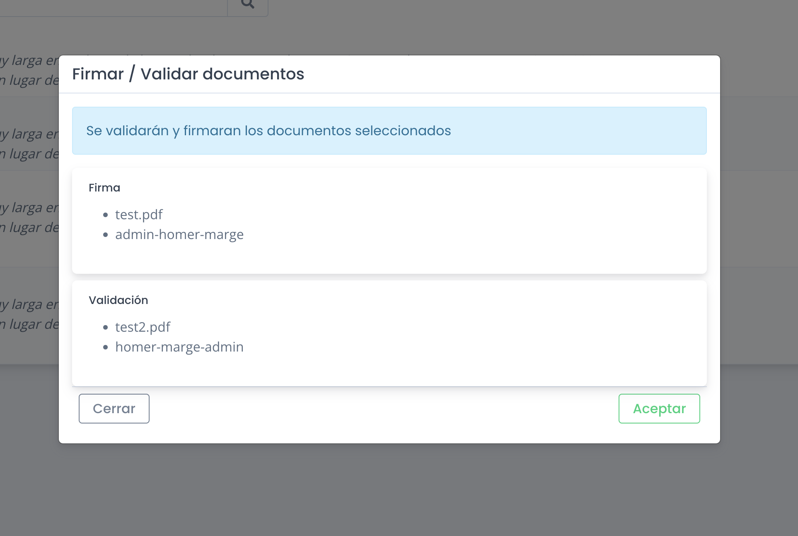

### Circuitos

Los usuarios pueden formar parte de uno o varios circuitos. Para cada circuito, cada usuario tiene dos propiedades: el orden dentro del mismo y el tipo de acción (firmar o validar). El circuito de firma funciona de manera "transaccional" a la hora de persistir las firmas, es decir, solamente cuando el documento haya completado el circuito se escribirán las firmas acumuladas durante el proceso.

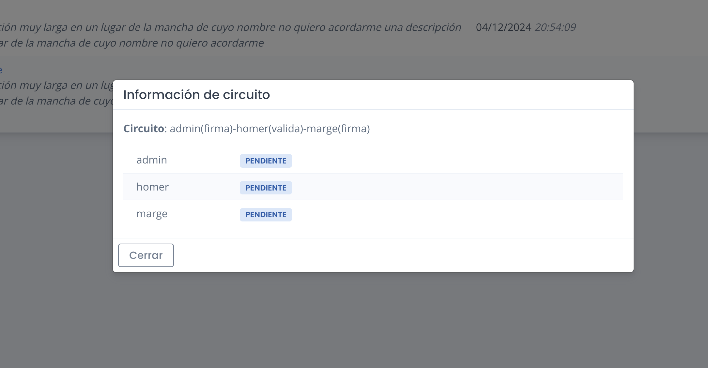

### Delegación de tarea

El administrador puede seleccionar cualquier usuario para ver su bandeja, pero las acciones sobre el documento mostradas serán diferentes si visualiza una bandeja ajena. Una tarea de firma o validación puede ser delegada en otro usuario y este la verá en su bandeja con una pequeña nota en la parte inferior. A diferencia de la sustitución, explicada más adelante, la delegación de una tarea es un acto puntual sobre una única tarea.

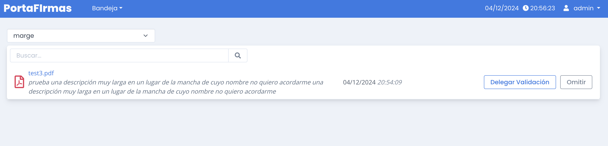

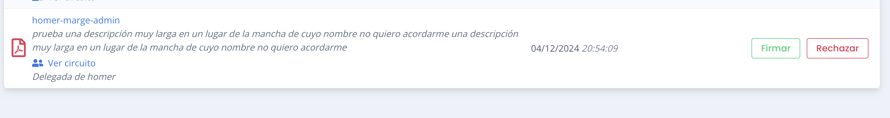

### Omisión de tarea

Solo el administrador puede omitir tareas. Solo las tareas que pertenecen a un circuito de firma pueden ser omitidas. Omitir una tarea significa básicamente saltarse a un usuario del circuito de firma. En ocasiones, un documento recorriendo un circuito de firma se ve retenido en la bandeja de un usuario que no lo puede atender por encontrarse ausente o cualquier otro motivo. La acción de este usuario no es imprescindible y no hay tiempo o necesidad de delegar en otro usuario, así que simplemente se omite la tarea para que el documento pase al siguiente usuario del circuito y siga su curso.

**Nota**: obsérvese el estado del documento en el circuito: el icono junto a la etiqueta **RECHAZADA**. Indica que si bien la tarea era de *Homer* esta le fue delegada al usuario *admin*, que fue quien finalmente realizó la acción.

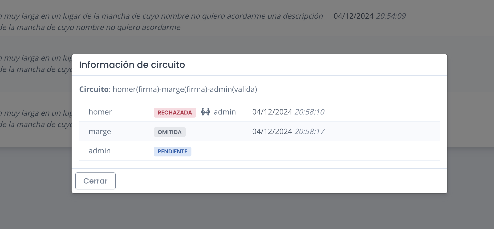

### Ausencias y sustituciones

Cuando un usuario se va a ausentar durante un periodo largo o programado, es posible crear una sustitución para que el administador no tenga que delegar manualmente todas las tareas que le van entrando al usuario ausente. Indicando el usuario que se ausenta y el usuario que le sustituye, todas las tareas del primero serán visibles por el segundo para que pueda atenderlas. Luego, basta con eliminar la sustitución para revertir el comportamiento.

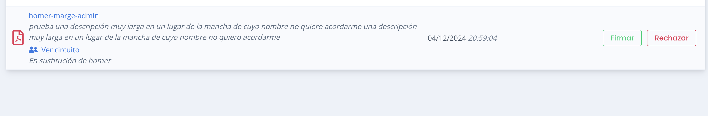

**Nota**: de forma similar al caso de la delegación, el icono junto a la etiqueta **FIRMADA** indica que si bien la tarea era de *Homer* el usuario *admin* fue quien realizó la acción como sustituto.

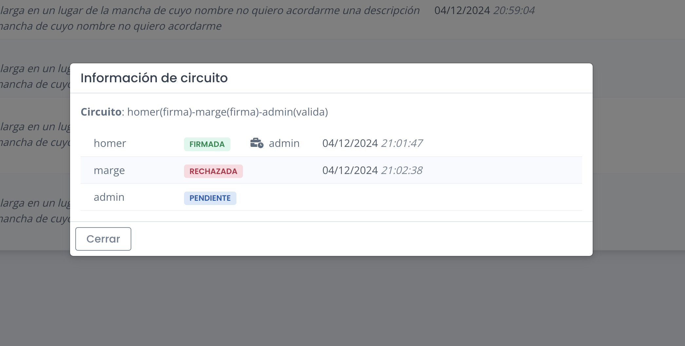

### Eventos

Como se ha visto anteriormente, todas las acciones que se realizan sobre los documentos quedan registradas en forma de eventos que permiten seguir la traza y saber no solo qué acción hizo cada usuario sino si lo hizo en delegación o sustitución de otro.

### Rol de administrador
Además de lo común al resto de usuarios el administrador tiene una serie de funcionalidades extra: puede ver la bandeja de cualquier usuario, delegar u omitir documentos y también es el responsable de crear y gestionar circuitos de firma y sustituciones.

## Descripción Técnica

Descripción de la aplicación a nivel técnico

## Modelo de datos


## Arquitectura e interconexión

Es respaldada por la siguiente sección del modelo:


El funcionamiento del portafirmas se puede resumir en tres pasos principales:

1. Ingreso del documento: se proporciona información necesaria, como el contenido del documento (o cómo obtenerlo), el usuario o el circuito de firma.

2. Procesamiento interno: una representación del documento vive en el portafirmas mientras se realizan las operaciones pertinentes: recorrer circuitos de firma, validaciones, aplicar firmas, manejar rechazos, etc.

3. Comunicación de resultados: una vez completado el ciclo de vida del documento hay que comunicar a los sistemas implicados los resultados (documento firmado, rechazado, etc.).

Dicho lo anterior, hay dos objetivos fundamentales a perseguir:

1. El portafirmas debería ser autocontenido. Aunque obviamente necesita interactuar con otros sistemas esto ocurre únicamente en su entrada y salida de datos (puntos 1 y 3 descritos anteriormente). Una vez el documento ingresa en el portafirmas no debería ser necesaria la conexión con sistemas externos para el funcionamiento de la aplicación, evitando así que su disponbilidad esté sujeta a la de terceros sistemas.


2. La integración con sistemas externos debe ser flexible y sencilla de adaptar, estando lo más desacoplada posible de la aplicación. El rol del portafirmas es básicamente gestionar la firma de documentos. La lógica de cómo se obtienen o se actualizan estos documentos de sistemas externos debería estar lo más desacoplada posible del núcleo de la aplicación. Un sistema puede almacenar los documentos en un repositorio online y otro en un sistema de ficheros local o una base de datos. El núcleo de la aplicación debería ser agnóstico de qué sistema se utiliza y los cambios para integrarla en estos diferentes sistemas deberían ser mínimos y estar en un único sitio.

Por ejemplo, véase el caso de enviarle a un usuario un documento para que lo firme. Usando un repositorio online que identifica los documentos mediante un *uuid* se podría hacer al portafirmas una petición con este aspecto:

```json
{
    "envioFirmaRepositorio": {
        "uri": "abcd-abcd-abcd-abcd",
        "usuario": "empleado1"
    }
}
```

O en el caso de un sistema de ficheros local:

```json
{
    "envioFirmaFileSystem": {
        "path": "/opt/archivos/2024/11/test.pdf",
        "usuario": "empleado1"
    }
}
```

O incluso aportando directamente el contenido:

```json
{
    "envioFirmaB64": {
        "base64": "aGVsbG...8gd29ybGQ=",
        "usuario": "empleado1"
    }
}
```

Con esta información, el portafirmas obtiene el cotenido del documento, crea una representación y está listo para trabajar con él. La aplicación usará una tabla en base de datos a modo de cola de tareas donde estos mensajes serán almacenados para su posterior procesamiento (a los efectos será prácticamente síncrono). Este sistema ofrece varias ventajas:

1. El punto de entrada es un mensaje en la tabla de tareas. Cómo llega ese mensaje a dicha tabla es irrelevante: puede ser mediante una API, un sistema de colas o cualquier otro método. Estos sistemas ni siquiera tendrían que vivir obligatoriamente en la aplicación de portafirmas sino que podrían ser terceras aplicaciones con acceso a la tabla de mensajes.

2. Registro y manejo errores: cada solicitud queda registrada. Si ocurre un fallo durante el procesamiento, puede analizarse y corregirse para reintentar la operación con la petición original.

Cuando un documento termina su ciclo de vida en la aplicación, por ejemplo, porque ha terminado de recorrer un circuito de firma, el siguiente paso es informar y hacer las actualizaciones necesarias a los sistemas implicados. De forma similiar al enfoque utilizado con la entrada, la aplicación no estará directamente acoplada a ningún sistema sino que escribirá una tarea en una tabla a modo de mensaje de salida. Por ejemplo, un mensaje referente a un documento que ha terminado de recorrer un circuito de firma podría tener este aspecto:

```json
{
    "circuitoCompletadoRepositorio": {
        "uri": "abcd-abcd-abcd-abcd",
        "firmas": [
          {
            "usuario": "usu1",
            "firma": "0000aaaa"
          },
          {
            "usuario": "usu2",
            "firma": "1111bbbb"
          }
        ],
        "rechazos": [
          {
            "usuario": "usu3",
            "motivo": "no conforme"
          }
        ]
    }
}
```
O si el documento fue obtenido de otra forma:

```json
{
    "circuitoCompletadoFileSystem": {
        "path": "/opt/archivos/2024/11/test.pdf",
        ...
    }
}
```

Es importante especificar en el mensaje de salida cómo entró el documento al sistema para después poder seleccionar la estrategia adecuada a la hora de actualizarlo. Exactamente igual que a la hora de obtener el documento, no tiene la misma implementación actualizar un documento en un sistema de ficheros que en un repositorio online.

Al igual que en el caso de los mensajes de entrada, la lógica para procesar estos mensajes de salida está completamente desacoplada del resto de la aplicación. De forma similar al caso de entrada, si los sistemas externos se encuentran caídos la información está almacenada y puede reintentarse la comunicación más adelante o incluso una tercera aplicación con acceso a la tabla de mensajes de salida podría ser la encargada de gestionar estas actualizaciones.


### Política de almacenamiento interno

Cuando un documento se envía al portafirmas, su contenido se procesa con dos objetivos principales:
1. Cálculo y persistencia del hash: Se genera y almacena en la base de datos el hash del documento, que será el elemento utilizado para la firma. 
2. Soporte para visualización: Se crea una copia temporal del contenido del documento en un directorio dedicado a ficheros temporales, lo que permite su visualización en la aplicación.

Una vez que el documento ha completado su ciclo de vida en la aplicación y deja de ser visible en las bandejas, ya no tiene sentido su almacenamiento. En ese momento, el sistema eliminará el fichero temporal, optimizando el uso del espacio y asegurando que su ocupación no crezca indefinidamente.


### Seguridad

La aplicación dispone de tres niveles de seguridad:

1. Seguridad a nivel de autenticación y autorización por rutas: se requiere autorización y se protegen las diferentes rutas exigiendo las credenciales y los roles adecuados para navegar a las mismas.
2. Seguridad a nivel de método: los diferentes casos de uso están anotados para requerir los roles pertinentes, por lo que si se consiguiese alcanzar una ruta por error o descuido aún sería necesario estar autenticado correctamente para ejecutar el caso de uso.
3. Seguridad a nivel de dominio: Un usuario autenticado tiene restricciones adicionales. Por ejemplo, aunque tenga permiso para descargar documentos, solo puede acceder a los que están en su bandeja. Este principio aplica a muchas acciones en la aplicación. Para evitar implementar comprobaciones manuales en cada caso, se introduce el concepto de dominio de seguridad. En este contexto, la entidad clave es la Tarea, sobre la cual se basan todas las acciones. Al definir una política de seguridad que limite el acceso a las tareas (por ejemplo, que solo puedan ser consultadas si son propias, delegadas o relacionadas por sustitución), se asegura automáticamente el cumplimiento de estas reglas en todos los casos de uso presentes y futuros.


