# Portafirmas

Esta es una aplicación desarrollada para un cliente, por lo que el código fuente es privado y se encuentra en otro repositorio. Se publica únicamente el README del proyecto.

### Descripción
Portafirmas de documentos electrónicos. El portafirmas no almacena documentos, tan solo una representación y un identificador a un repositorio documental externo. Posee las siguientes funcionalidades:
* Visualizar documentos
* Firmar o rechazar documentos a través de Autofirma
* Firmar múltiples documentos en bloque de una sola vez
* Listar documentos pendientes, firmados o rechazados
* Gestionar firmantes
* Gestionar circuitos de firma
* Obtener la información del circuito de un documento y su estado actual en dicho circuito
* Gestionar ausencias y permitir que un firmate sustituya a otro, quedando reflejo de esto en todas las acciones

Posee una API REST que permite:
* Enviar un documento a portafirmas para un firmante
* Enviar un documento a portafirmas para un circuito documental
* Recuperar un documento

Otras características:
* Modelo de comunicación asíncrona. Si los sistemas externos de los que depende la aplicación no responden la aplicación no falla, sino que la tarea queda en estado pendiente y se actualizará cuando dichos sistemas estén disponibles.
* Seguridad a nivel de dominio. No basta con proteger las rutas de la aplicación a nivel de rol. Un usuario no debería poder recuperar de base de datos un objeto sobre el que no tiene permisos.

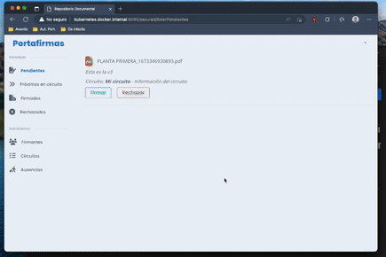

### Tecnologías:
* Quarkus
* Freemarker
* H2 (para desarrollo)

### Modelo de datos

A continuación de la imagen se describe brevemente el modelo de datos de la aplicación.

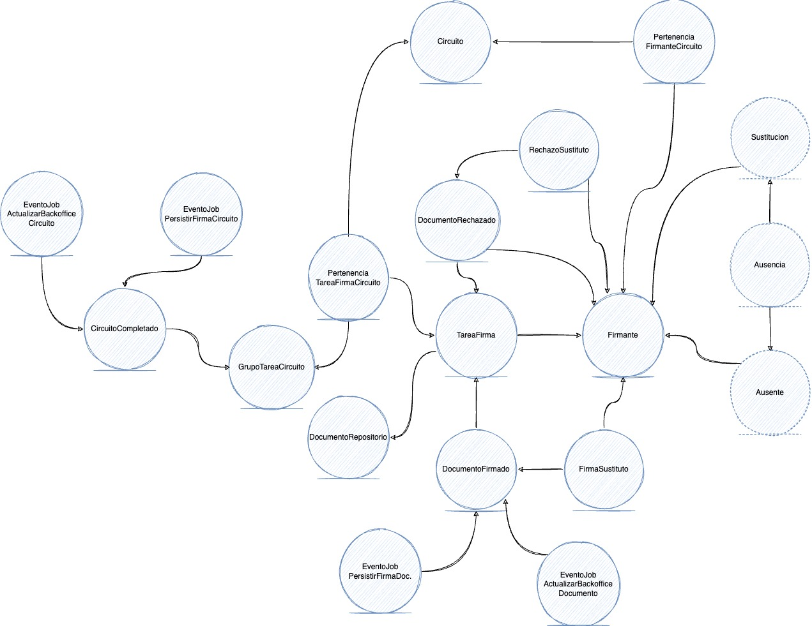

#### Descripción del modelo

Para facilitar su comprensión se describe el modelo separado en fases tal y como se desarrolló la aplicación

#### Fase 1: firma básica de un usuario
Cuando se envía un documento al portafirmas, se crea una **TareaFirma**, que representa una tarea asignada al usuario.
Esta es una entidad **securizada** y junto con la seguridad a nivel de dominio se garantiza que un usuario solo pueda acceder a una tarea y un
documento que le han sido asignados.
Así, **TareaFirma** apunta a un **DocumentoRepositorio** y a un **Firmante**. Cuando la tarea
es firmada o rechazada, se crean las entidades correspondientes **DocumentoFirmado** o
**DocumentoRechazado** (la primera almacenará la firma). De esta forma a través de servicios es fácil saber si una tarea está pendiente
o ha sido completada con una u otra acción.

#### Fase 2: circuitos
Para soportar los circuitos se introduce la entidad **Circuito**.
Se necesita una relación **PertenenciaFirmanteCircuito** que además posee
un atributo **posición**, ya que un firmante puede pertenecer a múltiples circuitos y además
tener un orden diferente en cada uno de ellos. Lógicamente las **TareaFirma** también apuntan
al **Circuito** a través de una relación de pertenencia **PertenenciaTareaFirmaCircuito**. Esta relación apunta a su vez a un **GrupoTareaCircuito**. Esto es necesario por la siguiente casuística:
* Se envía un documento A a un circuito de 4 firmantes, se crean 4 **TareaFirma**
* Se envía un documento B al mismo circuito, se crean otras 4 **TareaFirma**

Si ahora listásemos las tareas por circuitos sería imposible conocer la "remesa de envío"
y obtendríamos 8 **TareaFirma** sin poder distinguir entre ellas.

A partir de las relaciones anteriores y en combinación con las de la **Fase 1** es fácil
determinar si ha llegado el turno de un firmante para realizar una acción sobre un documento
de un circuito.

#### Fase 3: ausencias
Cuando un usuario se ausenta de su puesto por cualquier motivo (baja, vacaciones, etc...) es
posible configurar una **Ausencia** y delegar las tareas del usuario **Ausente** en otro que realiza la
**Sustitución**. El nombre de esta entidad originalmente era **Sustituto** pero
se cambió debido a que su nomenclatura podría inducir a error:
si dos usuarios A y B se ausentan y un usuario C sustituye a ambos,
podría resultar confuso hablar de que hay dos sustitutos. Lo que en realidad hay son dos **Sustituciones**, y en ambas casualmente el firmante sustituto es el mismo.
Estas 3 entidades se  han representado con línea discontinua porque son las únicas
del modelo que son mutables, es decir, serán eliminadas al deshacer la ausencia.

Si hay una **Ausencia** configurada, el **Firmante** sustituto recibirá los documentos como
si fuese el ausente. Al firmar o rechazar, se creará una **FirmaSustituto** o un **RechazoSutituto**
que apuntarán a las entidades descritas en la **Fase 1**. Esto hace que las acciones realizadas por un firmante
en sustitución de otro se mantengan para siempre aunque se deshaga la ausencia. Además se conserva toda la información:
se mantiene el firmante original de la tarea pero al mismo tiempo es sencillo conocer si debe atenderla o la ha atendido
un sustituto y en sustitución de quién.

#### Fase 4: Circuito de firma transaccional
El circuito de firma debe funcionar de manera transaccional, es decir, solo
cuando todos los firmantes han firmado se persisten las firmas en el documento.
Si un documento se encuentra en un circuito de cinco firmantes y el cuarto rechaza,
el documento no debe contener las firmas de los firmantes anteriores.

Para modelar este problema se usa la entidad **CircuitoCompletado** que apunta a la
entidad **GrupoTareaCircuito**. Cuando se firma un documento que está en circuito
se comprueba si con dicha firma el circuito ha quedado completado y en caso
afirmativo, se crea esta entidad que indica que el documento ahora se considera firmado.

#### Fase 5: Comunicación asíncrona
Cuando un documento pasa a estar firmado, ya sea por completar el circuito
o por tener un único firmante y que este complete la tarea, debe informarse
a los diferentes servicios externos de este cambio.

Para lograr esto basataría con atacar a dichos servicios, pero podría darse
el caso de que estuviesen caídos o saturados. Por ello se adopta un enfoque
asíncrono mediante las entidades en los extremos del diagrama que llevan la palabra **Evento** en su nombre.
Estas entidades extienden de **EventoJob** (no representada por simplificar el diagrama), la cual consta de los campos necesarios para controlar y asegurar
mediante un mecanismo de tareas asíncronas que la información es siempre entregada a los servicios de destino.

Hay una consideración interesante, y es que el proceso consta de dos llamadas a servicios distintos:

1. Actualizar el metadato de firma en el repositorio documental.
2. Actualizar el estado del documento a *FIRMADO* en el backoffice.

Podría darse el caso de que no estuviesen caídos ambos sistemas a la vez sino solo uno (de hecho es lo más probable).
La segunda tarea solo debería ejecutarse si la primera lo ha hecho con éxito. En este caso dado que la aplicación
es pequeña esta condición no se ha modelado y se controlará a nivel de código, pero podría ser interesante
la creación de una entidad **FirmaPersistida** que almacenase la respuesta exitosa del servidor y fuese necesaria para construir los **EventoJob** encargados de actualizar
el backoffice. De esta forma aseguraríamos obligatoriamente por diseño el cumplimiento de las reglas.

#### Fase 6: Omisión de firma
A veces surge la necesidad de crear una omisión de firma. Supóngase un circuito formado por `A -> B -> C`.
Es urgente que el documento complete el circuito, la firma de `B` no es imprescindible y por cualquier motivo dicho
firmante no está disponible en ese instante, pero no por un largo tiempo (por ejemplo, está en una reunión). Una solución más rápida y simple que la creación de una ausencia es
la **omisión** de la tarea. A diferencia de la **Ausencia** que afecta a todas las tareas del firmante,
la **Omisión** se aplica sobre una tarea puntual una sola vez. Si una tarea se omite, el documento sigue su camino
hasta el siguiente firmante y completa el circuito con normalidad, saltándose al firmante omitido. El modelado de esta funcionalidad es muy simple
y se limita a la creación de la entidad **TareaOmitida**.

Una reflexión obvia pero interesante es que la forma de abordar este problema no es eliminar la **TareaFirma**, sino
modelar una entidad que representa que ha sido omitida. De esta manera, el modelo contiene toda la información y
la aplicación no se salta simplemente la tarea porque no está, sino que tiene consicencia de que la tarea está pero  ha sido omitida.

#### Fase 7: Delegación de firma
La delegación de firma es otra necesidad recurrente para evitar crear una **Ausencia** en situaciones
que podrían resolverse de forma más simple. A nivel funcional podría verse como una "ausencia de un solo uso a nivel de tarea".
Dado un circuito `A -> B -> C`, se necesita obligatoriamente la firma de `B` o alguien equivalente y
este firmante no está disponible por un breve periodo de tiempo, por lo que sería tedioso gestionar
una **Ausencia**. La delegación de firma permite que otro firmante despache la tarea por `B` pero
de forma puntual solo para la tarea seleccionada, no convirtiéndose en su sustituto en toda la aplicación.

Para simplificar el diagrama, se muestra el modelado de esta solución por separado en lugar de en el diagrama principal:

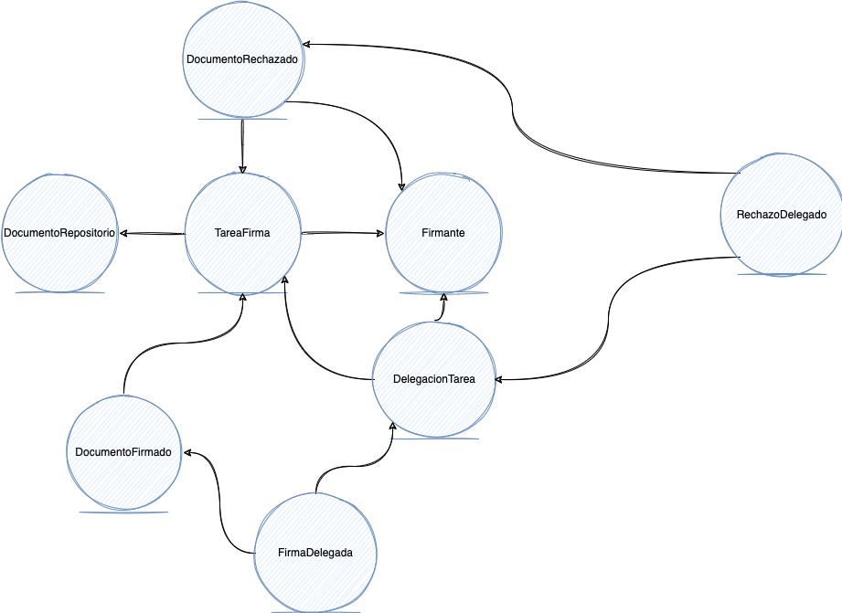

#### Líneaa futuras:

1. Implementsr patrón repositorio (DAO) para panache, ya que se empezó usando de la forma más directa (métodos estáticos) para experimentar la tecnología.
2. Crear en el framework el concepto de entidad auditada.
3. Logging: es necesario volcar en logs con lujo de detalles todo lo que ocurre en todo momento, para ello no solo se deben colocar logs de forma manual sino que a nivel de framework hay que hacer log por defecto de múltiples acciones

### Demostración

Se muestran algunas capturas y las vistas más relevantes de la aplicación. Para ello se utilizarán 4 usuarios ficticios:
* Homer
* Marge
* Bart
* Lisa

#### Pantalla de Login
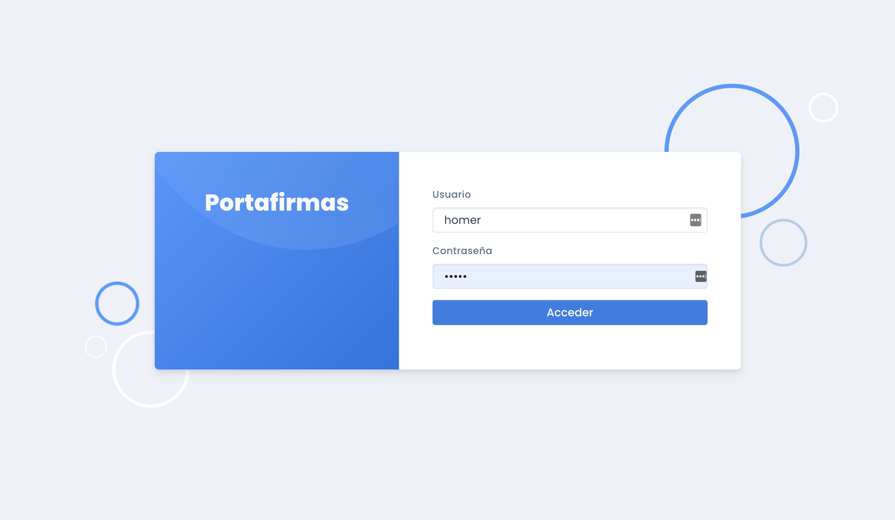

#### Listar documentos pendientes

La bandeja de tareas pendientes es la pantalla principal de la aplicación. En ella el usuario ve los documentos que debe
firmar tanto si son enviados a él personalmente (tercer documento) como si se encuentran recorriendo un circuito

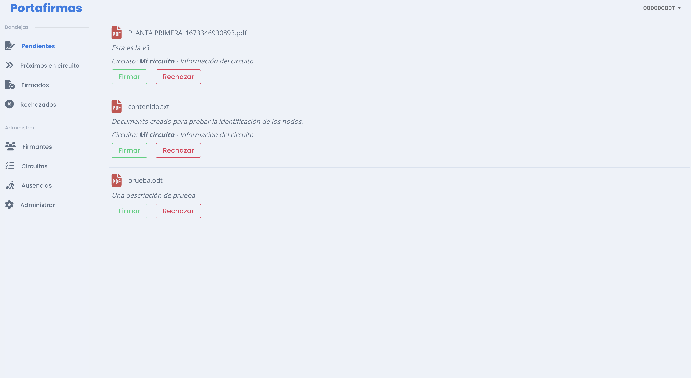

#### Visualizar Documento

Es posible visualizar un documento en una ventana emergente haciendo click sobre el mismo

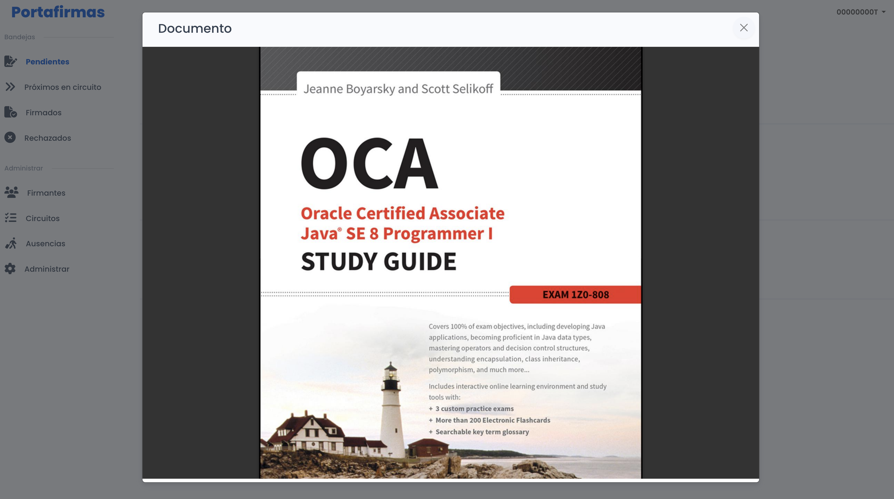

#### Rechazar documento

Al rechazar un documento es posible especificar un motivo de rechazo. El documento será movido a la bandeja de rechazados
para todos los usuarios del circuito y todos podrán ver el motivo de rechazo si se ha especificado uno

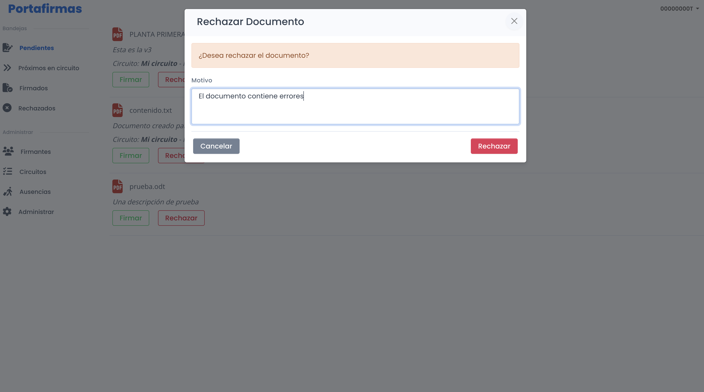

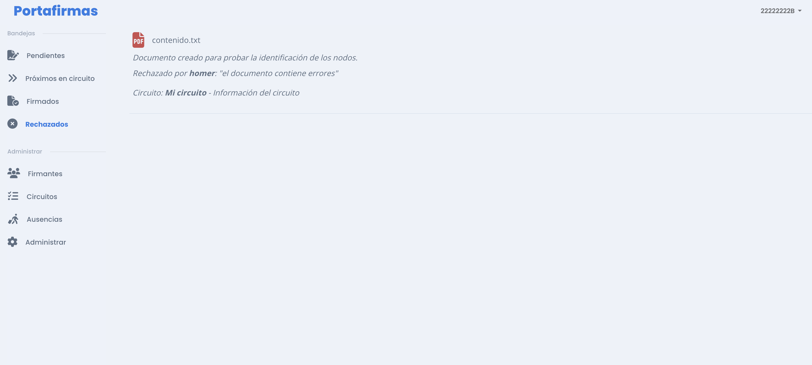

#### Vista de próximos documentos en circuito

La bandeja de *próximos en circuito* muestra documentos que nos llegarán próximamente porque se encuentran en un circuito
del cual formamos parte aunque aún no ha llegado nuestro turno para firmar. Esto permite que los usuarios puedan
adelantarse e ir revisando los documentos en paralelo sin esperar por la cola de firmantes. Cuando llega el turno del firmante
el documento desaparece de esta bandeja y aparece en la bandeja de *pendientes* automáticamente.

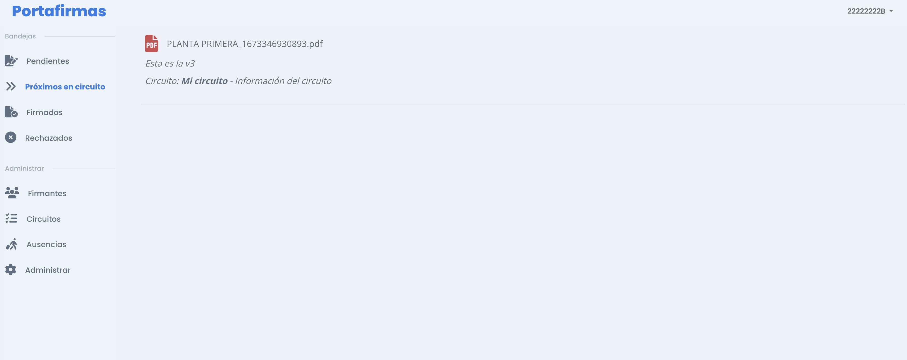

#### Estado del documento en el circuito

En todo momento para cualquier usuario implicado es posible consultar el estado del documento en el circuito. Tanto las acciones
de firma como de rechazo quedan registradas.

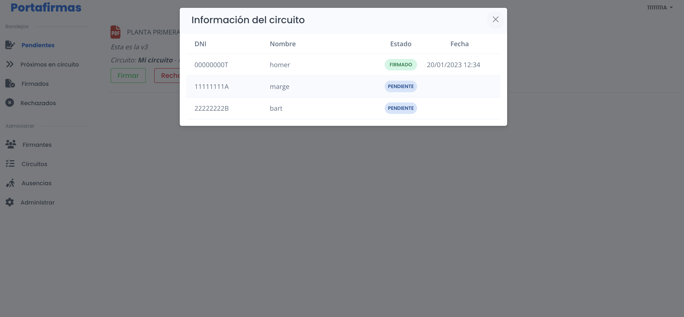

#### Alta de firmantes

El panel de administración solo es visible y accesible para los usuarios con rol de *Administrador*. Una de sus
pantallas permite crear y gestionar firmantes en la aplicación.

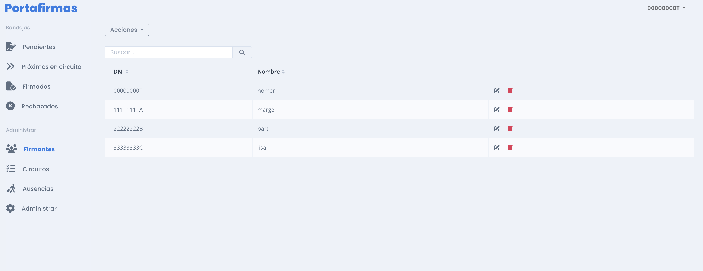

#### Listar circuitos

Desde esta sección es posible también consultar y administrar los circuitos de firma.

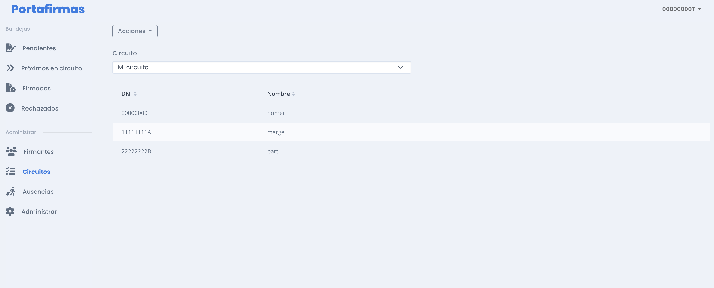

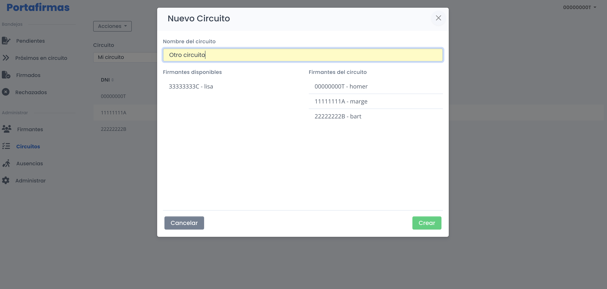

#### Gestionar Ausencias

Esta pantalla permite gestionar las ausencias.

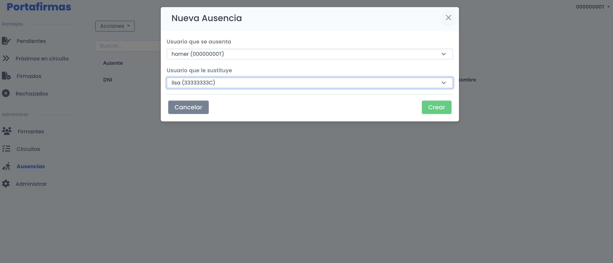

Hecho lo anterior, el usuario que hace de sustituto visualizará los documentos del usuario ausente en su bandeja.

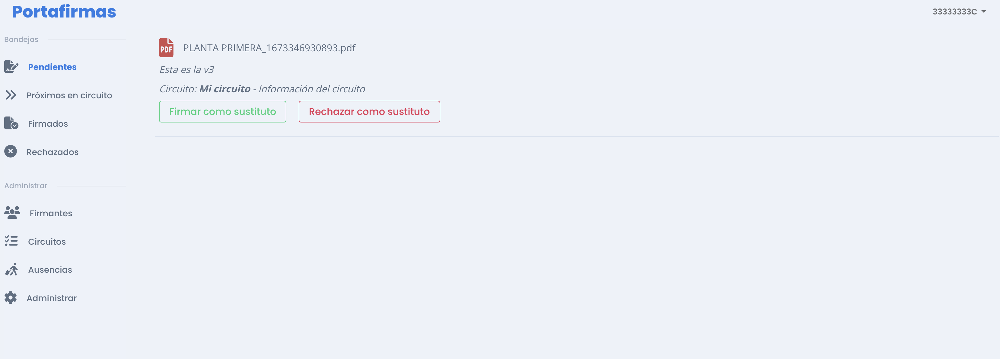

Las acciones realizadas por un sustituto o un delegado quedan registradas en la aplicación al mismo tiempo que se
conserva la información del firmante original.

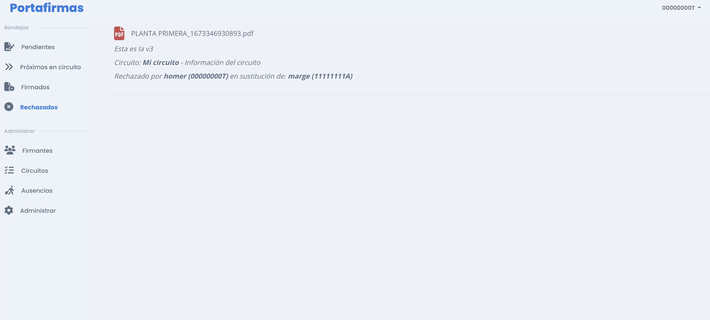

El icono junto al nombre de *Homer* indica que actualmente está ausente, mientras que el icono junto a *FIRMADO*
indica que el documento fue firmado por un sustituto. Mientras que el primero desaparecerá el día que Homer regrese
a su puesto, el segundo quedará registrado para siempre.

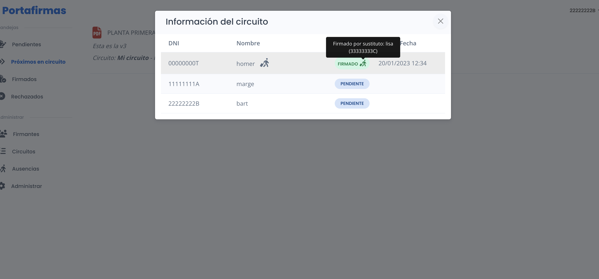

#### Administrar tareas

La pantalla de administrar tareas permite gestionar acciones sobre tareas puntuales. Seleccionando un usuario el administrador
puede ver las tareas que dicho usuario tiene pendientes de firma.

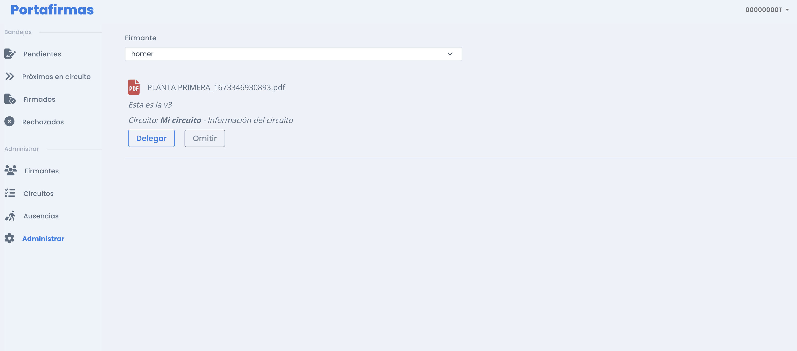

En el caso de que el administrador omita la tarea para Homer, ya no será necesario que este firme. El documento
continuará el circuito y aparecerá en la bandeja de Marge.

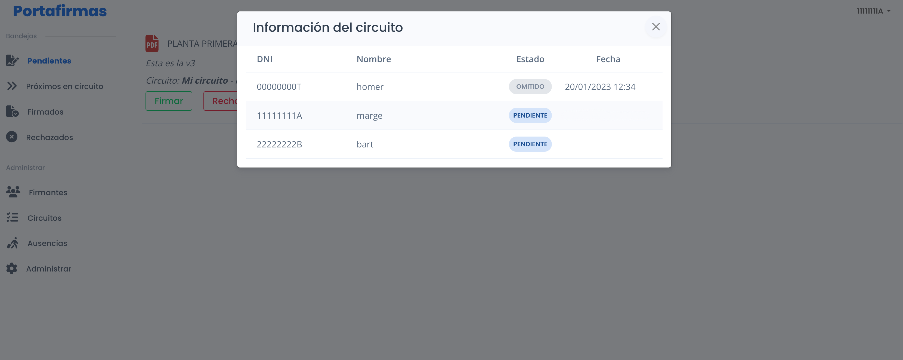

Por el contrario, si en lugar de omitir la tarea se delega en otro firmante, de forma similar a la sustitución,
la tarea aparecerá en la bandeja del firmante en que se delega la tarea. Firma y rechazo quedan registrados manteniendo
tanto la información del firmante original como la del firmante delegado.

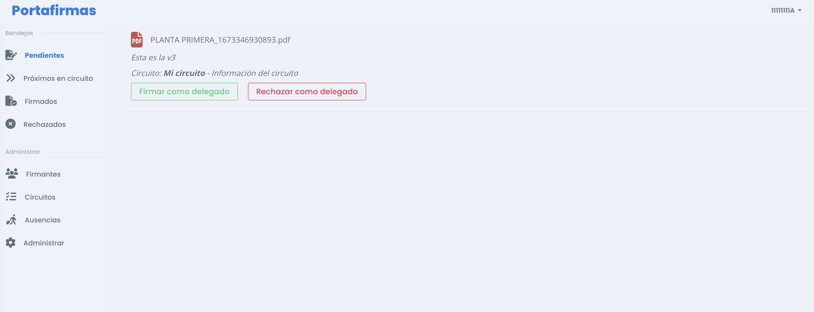

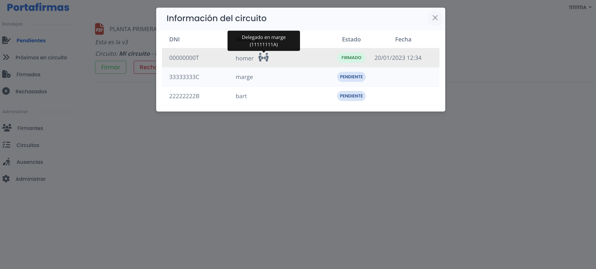