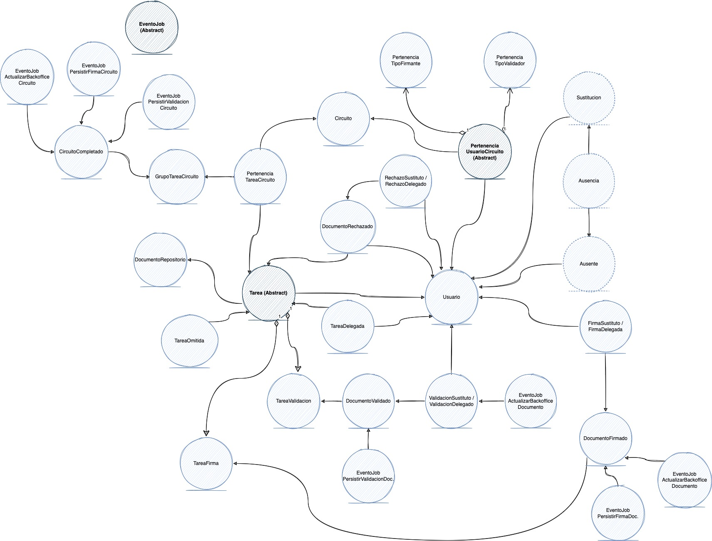
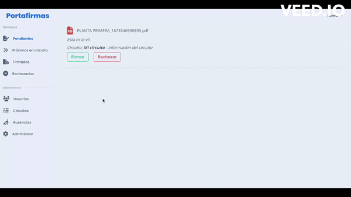
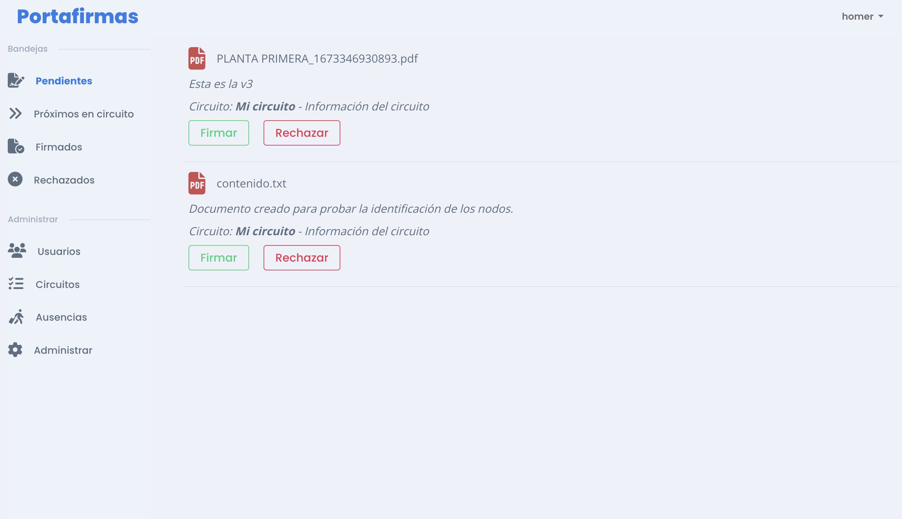
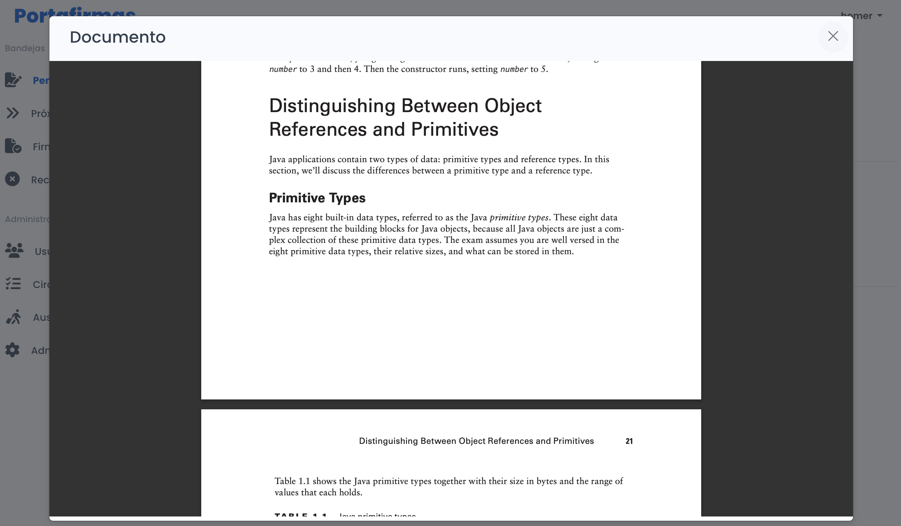
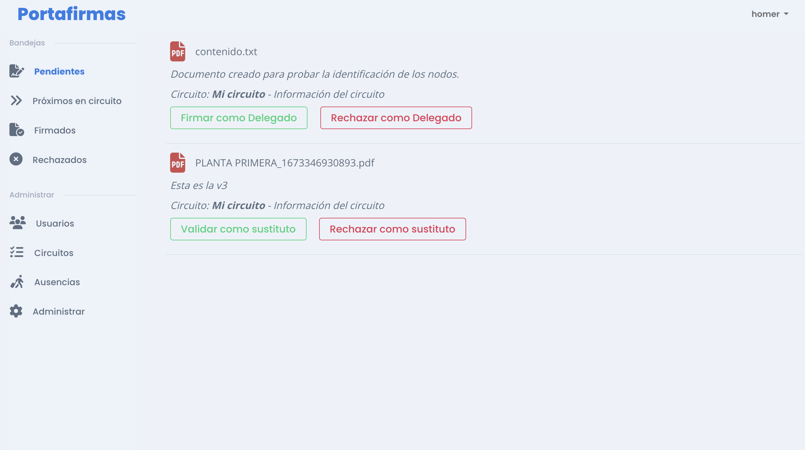
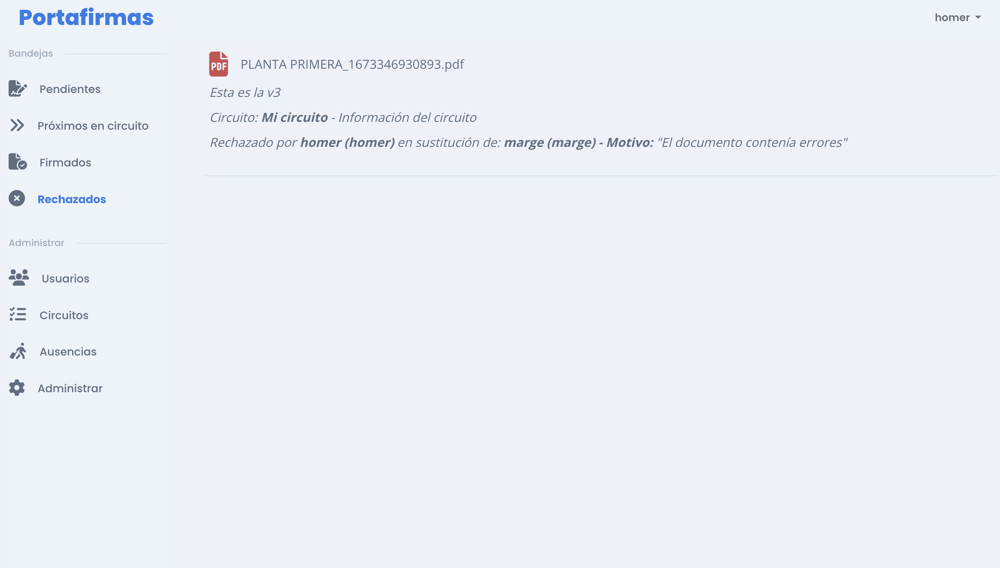
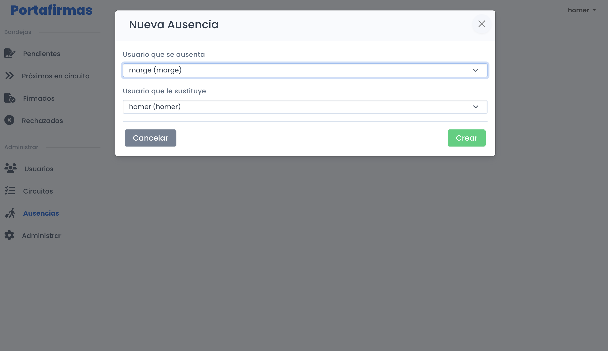
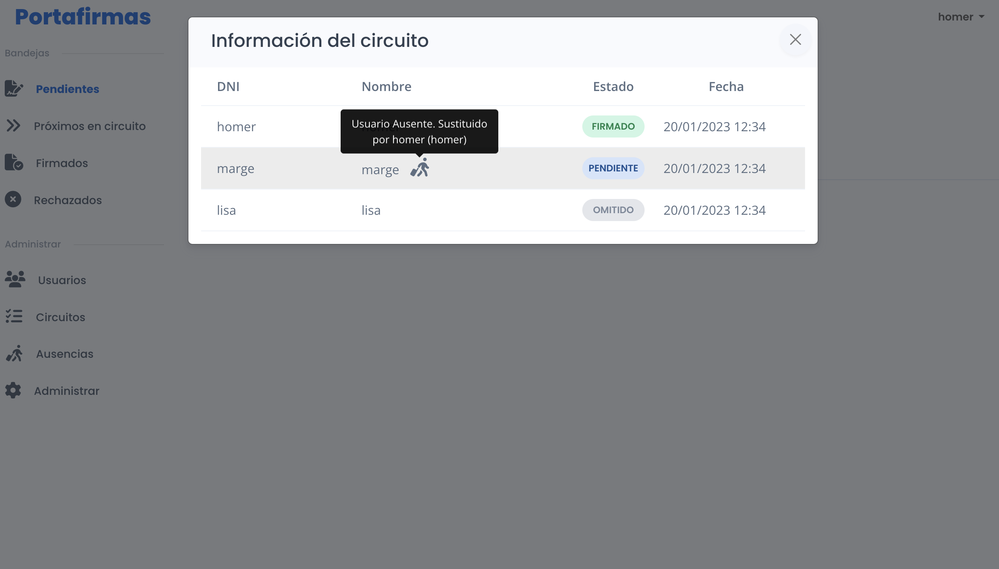

# Portafirmas

El código de este proyecto ha sido diseñado para un cliente privado y no está públicamente disponible. Únicamente se muestra la descripción del proyecto.

### Descripción
Portafirmas de documentos electrónicos. El portafirmas no almacena documentos, tan solo una representación y un identificador a un repositorio documental externo. Posee las siguientes funcionalidades:
* Visualizar documentos
* Firmar o rechazar documentos a través de Autofirma
* Firmar múltiples documentos en bloque de una sola vez
* Listar documentos pendientes, firmados o rechazados
* Gestionar usuarios
* Gestionar circuitos de firma
* Obtener la información del circuito de un documento y su estado actual en dicho circuito
* Gestionar ausencias y permitir que un firmate sustituya a otro, quedando reflejo de esto en todas las acciones

Posee una API REST que permite:
* Enviar un documento a portafirmas para un usuario
* Enviar un documento a portafirmas para un circuito documental
* Recuperar un documento

Otras características:
* Modelo de comunicación asíncrona. Si los sistemas externos de los que depende la aplicación no responden la aplicación no falla, sino que la tarea queda en estado pendiente y se actualizará cuando dichos sistemas estén disponibles.
* Seguridad a nivel de dominio. No basta con proteger las rutas de la aplicación a nivel de rol. Un usuario no debería poder recuperar de base de datos un objeto sobre el que no tiene permisos.

### Tecnologías:
* Quarkus
* Freemarker
* H2 (para desarrollo)

### Modelo de datos

A continuación se describe el modelo de datos por fases tal y como fue surgiendo y evolucionando según se iba desarrollando la aplicación.

#### Fase 1: firma y validación de un usuario
La **Tarea** representa una tarea que un usuario debe atender. Apunta a un **DocumentoRepositorio** y
a un **Usuario**. Cuando la tarea es firmada o rechazada se crean las entidades correspondientes que apuntan
a dicha **Tarea** (**DocumentoFirmado**, **DocumentoRechazado**). Así, mediante este modelo resulta fácil a nivel
de servicio comprobar el estado de una tarea.

Para la validación, el modelo es una copia exacta de la firma, solo que empleando las entidades
propias como **TareaValidacion** o **DocumentoValidado**.

Ambos tipos de tarea extienden de la entidad abstracta **Tarea**. Este modelado polimórfico permite generalización
y flexibilidad al mismo tiempo, sin perder la seguridad de tipos. Por ejemplo, para casos generales como listar
todas las tareas de un circuito se pueden listar las entidades **Tarea**, pero a la hora de procesar una **Tarea**
es trivial conocer y procesar cada caso concreto mediante un patrón *visitor* o utilizando los tipos concretos.

#### Fase 2: circuitos
Para soportar los circuitos se introduce la entidad **Circuito**.
Se necesita una relación **PertenenciaUsuarioCircuito** que además posee
un atributo **posición**, ya que un usuario puede pertenecer a múltiples circuitos y además
tener un orden diferente en cada uno de ellos. Además, cada usuario puede estar en dicho circuito como validador
o como firmante, por lo que la relación de pertenencia se modela de manera polimórfica y se extienden de ella
**PertenenciaTipoFirmante** y **PertenenciaTipoValidador**.

Cuando se envía un documento a un circuito y hay que crear una **TareaFirma** o **TareaValidacion** para cada
**Usuario** del circuito según el caso, basta con listar las pertenencias abstractas, y mediante un patrón
*visitor* resulta trivial determinar el tipo de tarea concreta que se debe crear.

Respecto a la **Tarea**, se relaciona con el **Circuito** a través de una relación 
**PertenenciaTareaCircuito**. Esta relación apunta 
a su vez a un **GrupoTareaCircuito**. Esto es necesario por la siguiente casuística:
* Se envía un documento A a un circuito de 4 usuarios, se crean 4 **Tarea**
* Se envía un documento B al mismo circuito, se crean otras 4 **Tarea**

Si ahora listásemos las tareas por circuitos sería imposible conocer la "remesa de envío"
y obtendríamos 8 **Tarea** sin poder distinguir entre ellas.

A partir de las relaciones anteriores y en combinación con las de la **Fase 1** es fácil
determinar si ha llegado el turno de un usuario para realizar una acción sobre un documento
de un circuito.

#### Fase 3: ausencias
Cuando un usuario se ausenta de su puesto por cualquier motivo (baja, vacaciones, etc...) es
posible configurar una **Ausencia** y delegar las tareas del usuario **Ausente** en otro que realiza la
**Sustitución**. El nombre de esta entidad originalmente era **Sustituto** pero
se cambió debido a que su nomenclatura podría inducir a error:
si dos usuarios A y B se ausentan y un usuario C sustituye a ambos,
podría resultar confuso hablar de que hay dos sustitutos. Lo que en realidad hay son dos **Sustituciones**, y en ambas casualmente el usuario sustituto es el mismo.
Estas 3 entidades se  han representado con línea discontinua porque son las únicas
del modelo que son mutables, es decir, serán eliminadas al deshacer la ausencia.

Si hay una **Ausencia** configurada, el **Usuario** sustituto recibirá los documentos como
si fuese el ausente. Al firmar o rechazar, se creará una **FirmaSustituto** o un **RechazoSutituto**
que apuntarán a las entidades descritas en la **Fase 1**. Esto hace que las acciones realizadas por un usuario
en sustitución de otro se mantengan para siempre aunque se deshaga la ausencia. Además se conserva toda la información:
se mantiene el usuario original de la tarea pero al mismo tiempo es sencillo conocer si debe atenderla o la ha atendido
un sustituto y en sustitución de quién.

#### Fase 4: Circuito de firma transaccional
El circuito de firma debe funcionar de manera transaccional, es decir, solo
cuando todos los usuarios han firmado se persisten las firmas en el documento.
Si un documento se encuentra en un circuito de cinco usuarios y el cuarto rechaza o el documento es reucperado,
dicho documento no debe contener las firmas añadidas en el proceso.

Para modelar este problema se usa la entidad **CircuitoCompletado** que apunta a la
entidad **GrupoTareaCircuito**. Cuando se firma un documento que está en circuito
se comprueba si con dicha firma el circuito ha quedado completado y en caso
afirmativo, se crea esta entidad que indica que el documento ahora se considera firmado.

#### Fase 5: Comunicación asíncrona
Cuando un documento pasa a estar firmado (o validado), ya sea por completar el circuito
o por tener un único usuario y que este complete la tarea, debe informarse
a los diferentes servicios externos de este cambio.

Para lograr esto basataría con atacar a dichos servicios, pero podría darse
el caso de que estuviesen caídos o saturados. Por ello se adopta un enfoque
asíncrono mediante las entidades en los extremos del diagrama que llevan la palabra **Evento** en su nombre.
Estas entidades extienden de **EventoJob** (no representada por simplificar el diagrama), la cual consta de los campos necesarios para controlar y asegurar
mediante un mecanismo de tareas asíncronas que la información es siempre entregada a los servicios de destino.

Hay una consideración interesante, y es que el proceso consta de dos llamadas a servicios distintos:

1. Actualizar el metadato de firma en el repositorio documental.
2. Actualizar el estado del documento a *FIRMADO* en el backoffice.

Podría darse el caso de que no estuviesen caídos ambos sistemas a la vez sino solo uno (de hecho es lo más probable).
La segunda tarea solo debería ejecutarse si la primera lo ha hecho con éxito. En este caso dado que la aplicación
es pequeña esta condición no se ha modelado y se controlará a nivel de código, pero podría ser interesante
la creación de una entidad **FirmaPersistida** que almacenase la respuesta exitosa del servidor y fuese necesaria para construir los **EventoJob** encargados de actualizar
el backoffice. De esta forma aseguraríamos obligatoriamente por diseño el cumplimiento de las reglas.

#### Fase 6: Omisión de tarea
A veces surge la necesidad de crear una omisión de tarea. Supóngase un circuito formado por `A -> B -> C`.
Es urgente que el documento complete el circuito, la acción de `B` no es imprescindible y por cualquier motivo dicho
usuario no está disponible en ese instante, pero no por un largo tiempo (por ejemplo, está en una reunión). Una solución más rápida y simple que la creación de una ausencia es
la **omisión** de la tarea. A diferencia de la **Ausencia** que afecta a todas las tareas del usuario,
la **Omisión** se aplica sobre una tarea puntual una sola vez. Si una tarea se omite, el documento sigue su camino
hasta el siguiente usuario y completa el circuito con normalidad, saltándose al usuario omitido. El modelado de esta funcionalidad es muy simple
y se limita a la creación de la entidad **TareaOmitida**.

#### Fase 7: Delegación de tarea
La delegación de tarea es otra necesidad recurrente para evitar crear una **Ausencia** en situaciones
que podrían resolverse de forma más simple. A nivel funcional podría verse como una "ausencia de un solo uso a nivel de tarea".
Dado un circuito `A -> B -> C`, se necesita obligatoriamente la acción de `B` o alguien equivalente y
este usuario no está disponible por un breve periodo de tiempo, por lo que sería tedioso gestionar
una **Ausencia**. La delegación de tarea permite que otro usuario despache la tarea por `B` pero
de forma puntual solo para la tarea seleccionada, no convirtiéndose en su sustituto en toda la aplicación.

Para delegar una tarea el modelo posee una entidad **TareaDelegada** que apunta a la **Tarea**. De forma
exactamente igual que ocurre con la ausencia, hay entidades que representan si una tarea delegada ha sido
firmada, rechazada o validada. Para simplificar el diagrama, estas clases se han representado juntas
(véase por ejemplo **RechazoDelegado / RechazoSustituto**), pero son entidades diferentes en la aplicación.

#### Observaciones sobre el diseño del modelo
Supóngase que se necesita saber si una **Tarea** está *PENDIENTE*. En un modelo más básico o tradicional la **Tarea** tendría simplemente una 
variable *Estado* que representaría su situación. Con este modelo, las
tareas pendientes son aquellas tareas para las que no existe un **DocumentoFirmado/Validado** o **DocumentoRechazado** que les apunte.
Este estilo de modelado basado en diseños inmutables puede parecer una complicación innecesaria de la forma de pensar, ya que no se obtienen los
 datos de manera tan inmediata, pero lo que se consigue es que el modelo
únicamente registre los hechos y sea la capa de servicios la que interprete dichos hechos de acuerdo a la lógica de negocio. 
En el código, este modelo produce la ausencia de valores nulos o en un estado inconsistente y una fuerte seguridad de tipos. Modificar o añadir nueva funcionalidad 
a la aplicación incluso si se encuentra en un estado muy avanzado resulta extremadamente fácil y seguro.

Además, dado que el modelo registra absolutamente todos los hechos, hay una gran cantidad de
información que es posible explotar de forma trivial en los casos en que se desee. Por citar un ejemplo práctico, a la aplicación le resulta natural saber si
una tarea fue delegada en otro usuario, quién la delegó y si finalmente fue el usuario delegado quien la completó y en nombre de quién.

#### Líneas futuras:

1. Crear en el framework el concepto de entidad auditada.
2. Crear en el framework el concepto de seguridad a nivel de dominio para que un usuario no pueda llegar por url a visualizar un documento que no se le ha enviado a él.
3. Logging: es necesario volcar en logs con lujo de detalles todo lo que ocurre en todo momento, para ello no solo se deben colocar logs de forma manual sino que a nivel de framework hay que hacer log por defecto de múltiples acciones.
4. Implementar concepto de versionado de comando a nivel de framework para controlar concurrencia.

### Capturas

A continuación se muestran algunas capturas del uso de la aplicación. No se muestran todos los escenarios posibles o casos de uso,
sino únicamente un vistazo general del aspecto de la aplicación.

Integración con Autofirma:

Pantalla de Login:

Bandeja de tareas pendientes:

Visualización de un documento:

Tareas pendientes para las que el usuario ha sido configurado como sustituto o delegado:

Bandeja de rechazados:

Creación de una ausencia en el panel de administración:

Consulta del estado de un documento en el circuito. El icono de ausencia o tarea delegada puede aparecer junto al nombre del usuario o dentro de
la etiqueta de estado de la tarea. En este caso, el icono junto al nombre de Marge indica que esta se encuentra actualmente ausente. Si Homer firma en su nombre,
este mismo icono también aparecerá dentro de la etiqueta *Firmado*. Mientras que el icono junto al nombre de Marge desaparecerá el día que regrese a su puesto y
se deshaga la ausencia, el icono dentro de la etiqueta se conservará para siempre, reflejando que en su momento fue Homer quien firmó en susticuión de Marge.

